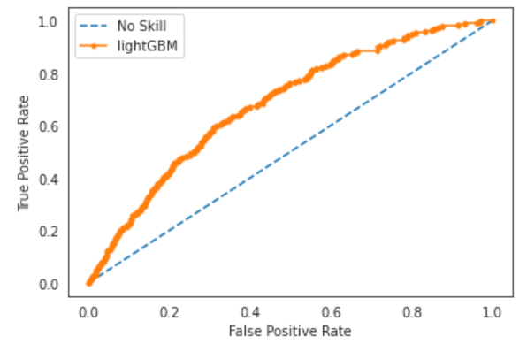
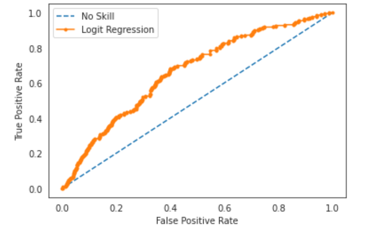
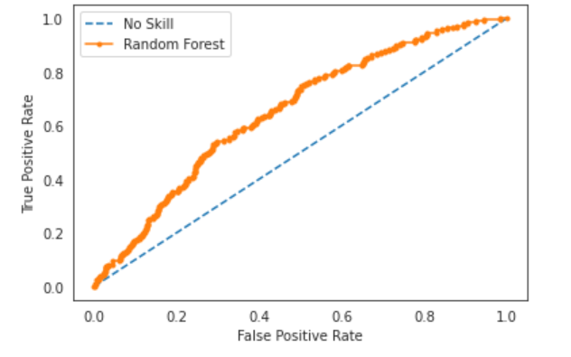
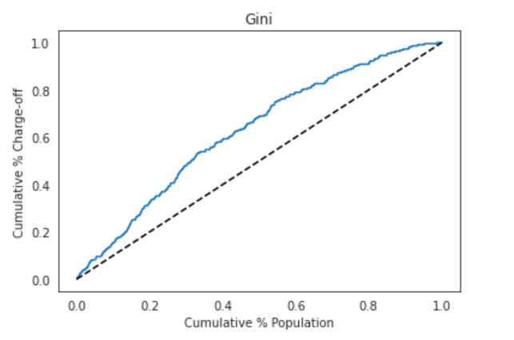
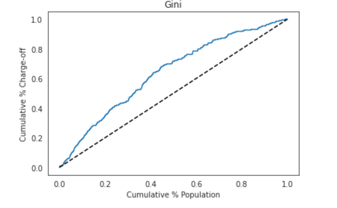
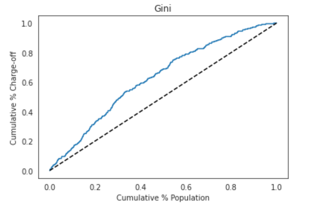
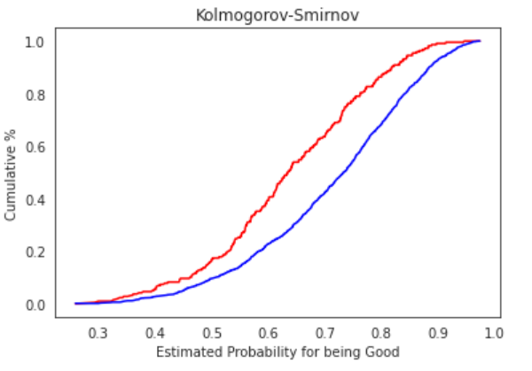
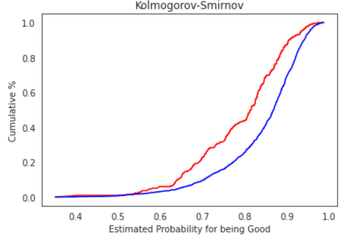
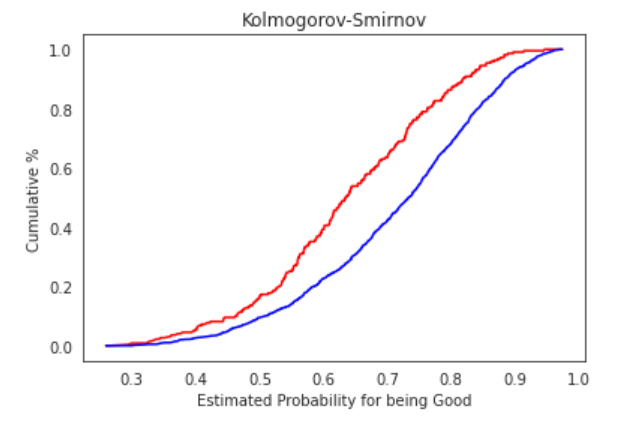

update: 09/02/2020

# LendingClub Data Challenge
Name: Tao He

This challenge is to predict Lending Club's "charge-off" label by using this company's data in 2011 and 2013. To limit the "charge-off" cases, as equivalent of "default", is to reduce the risk of losing money in this bussines. 

There three main steps in the analysis:
1. Data exploration and visulization
2. Feature Engineering 
3. Prediction models including Logistic Regression, Random Forest, and LightGBM

Jupyter notebooks for prediction model section:
- [LR_predict_model for Logistic Regression Classifier](LR_predict_model.ipynb)
- [RF_predict_model for Ramom Forest Classifier](RF_predict_model.ipynb)
- [predict_model-LightGBM for LightGBM Classifier](predict_model-LightGBM.ipynb)

Jupyter notebooks for feature engineering
- [feature_selection_eng_LR for Logistic Regression features](feature_selection_eng_LR.ipynb)
- [feature_selection_eng_RF_GBM_model for Random Forest and LightGBM features](feature_selection_eng_RF_GBM_model.ipynb)

Jupyter notebooks for data exploration and visulization
- [data_exploration_1](data_exploration_1.ipynb)
- [data_exploration_2](data_exploration_2.ipynb)
- [data_exploration_3](data_exploration_3.ipynb)

## Five Questions to be Answered:
### 1. Why did you choose the specific modeling algorithm you did
Three types of models were applied to compare their performance. They are logistic regression model, random forest model, and LightGBM model.

Logistic regression (LR) model, which uses sigmoid function to transform the linear regression into the probablity, uses the features' linear relation with target to fit. The benifits of LR model includes its diretcly indicate the feature's weights, thus the impact of the features on the prediction.To reduce the overfitting, the L1 and L2 regularization were used. 

Random forest(RF) model, as the ensemble method of decision trees, combines the latter's advantage of less bias with its own improvement on the reduction of variance, which is the key issue of decision tree. Compared with LR model, the RF model could capture the interaction relationship between features and can skip the scaling and normalization process, which is the eseential step for LR. 

LightGBM model, as one type of  gradient boosting tree model, is currently one of the most popular models. As the counterpart of XGBOOST model, it has similar performance as
- Faster execution speed than other gradient boosting tree models
- Performs so well that many Kaggle players won the competitions with XGBOOST

Popluar in production enviroments as: 
- Parallelization of tree construction using all of your CPU cores during training.
- Distributed Computing for training very large models using a cluster of machines.
- Out-of-Core Computing for very large datasets that don’t fit into memory.
- Cache Optimization of data structures and algorithm to make best use of hardware.

The main differences between lightGBM and XGBOOST are:
- LightGBM uses level-wise tree grwoth, while XGBOOST uses leaf-wise growth
- LightGBM applies histogram approximation method to run faster than histogram exact value method in XGBOOST

To compare those model's performance, the ROC-AUC score is applied. Another two scores: Gini coefficient, and max diff of Kolmogorov-Smirnov (K-S) curve are selected. THey are commonly used in credit risk industry to evaluate the model’s discriminatory power. The larger the Gini coefficient and max Kolmogorov-Smirnove, the better the models are.

The resuls of different models as shown below:

| Model         |    Roc_auc  | Gini Coef     | K-S max |
| :---          |    :----:   |         :---: |   ---:  |
| Logistic Reg  |     0.664   |    0.329      |  0.280  |
| Random Forest |     0.653   |    0.305      |  0.247  |
| LightGBM      |     0.683   |    0.365      |  0.287  |

As the results shown, LightGBM performs the best with ROC-AUC 0.683, Gini cofficient 0.365 and K-S max as 0.287. Logistic regression model ranks the 2nd and Random Forest is ordered last.

Below are the performance plots

__ROC AUC__

LightGBM ROC-AUC 

Logistic Regression ROC-AUC

Random Forest ROC-AUC

__Gini Curve__

LightGBM Gini curve

Logistic Regression Gini curve

Random Forest Gini curve 

__K-S Curve__

LightGBM K-S curve

Logistic Regression Gini curve

Random Forest Gini curve

### 2. How did you handle missing data in your analysis? What are the strengths and weaknesses of your approach? What are alternate ways to handle missing data?
There are serveral ways to deal with missing data:
- imputation with constant, median, mean, mode and other descriptive statistical parameters. (simple, may not accurate)
- imputatation with inferred by other data (kmeans method as an example, may not accurate)
- remove the entries that has missing data (data bias, possible useful information lost) 

The features have missing values are dropped when in conditions below, 

- Data sets includes those in years of 2011 and 2013. Feature dropped if the data in one feature missed all in either one of two years
- When more than 50% of missing in the feature of whole data sets

For the RF model and LightGBM, missing data was handled by imputation with certain constants. For example, for the numerical data, -999.9 was used for imputation and "Missing" was applied for string type before label encoding to numerical. Because of the function of decision tree, these constants will be assigned to the same node of trees. The benifits includes: convinience and simple, and surpuringly effective for tree-like model. And probally those data missed indicates those events did not occur yet.

For the LR model, becuase the features are all in the format of one-hot-encoding. So, the imputation method is to fill with constant, which is followed by that used in RF model and LightGBM.

### 3. Discuss any limitations to the data.

Better if someone in the Lending Club could explain what means for missing value in features. Some missing values may left without purpose or data logging issue, but some are not. It may indicate the event in that feature not occur yet.

Lack of time series data to monitor the change of features including FICO score, Grade by LC, Subgrade by LC, Interet Rate, Loan Payment.

Economic indicators: such as GDP growth, empolyement data and other major ecnomical indicators. Those factors could impact on borrowers' ability to pay back the money as they has higher risk being income loss, not to say even being laid off when the economy worsen.  

### 4. Discuss additional variables that weren’t present in the data but could have greatly improved your model.
Economic indicators: such as GDP growth, empolyement data and other major economical indicators. Those data and indicators would largely impact on borrowers's ability to pay back loan as they are not controllable by individuals.

### 5. What are the best opportunities to limit Lending Club charge-offs
(To be continue)

### 6. How would you mesure the stability of your insights over time, if you were in charge of implementing the identified opportunities?
The model prediction over time will be challenged by the change of underline distribution of the data samples. For example, a series of new type of employement emerges as Youtubers, Instgrammers. They are seldom exist in the traning data at earlier time when the working prediction model was built. Another example is more and more young people apply for loan so the age distribution will be different than before. The model performance may reduce as the distribution of population changes.

The "population Stability Index (PSI)", which is a score to evaluate the how difference between two data population, could be implemented for stability test. In a short term, if index is <0.1, the two populations are not much change and it's relative safe to use the working model; if index is in the range of 0.1 and 0.25, it is better to be caution and to monitor the model's performance carefullly, even be prepared to train a new model if working model performance get worse; if index >0.25, the working model should be immedietly be discarded and new model has to be trained as quick as possible.

### 7, Which account does your model predict as most likely to charge off that did not? Why do you think this false positive occurred?
(To be continue)
